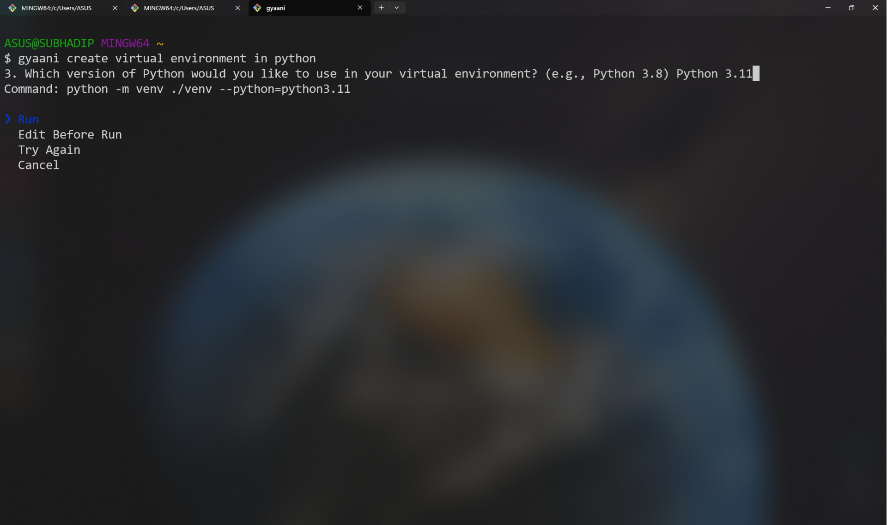
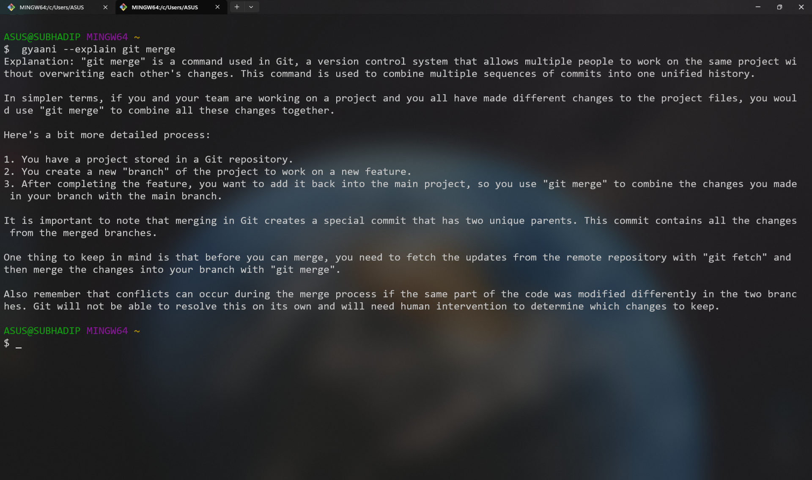
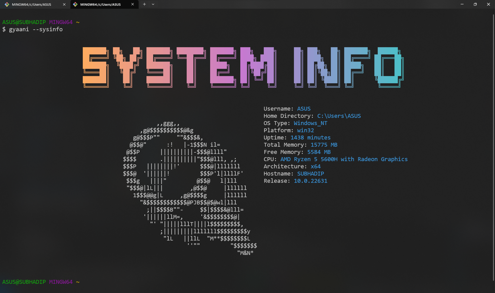

# Gyaani

`gyaani` is an **AI-powered terminal npm package** that enhances your command-line experience with smart features. It assists with various tasks—from system insights to generating images—directly from your terminal, making your workflow faster and more efficient.

---

## Key Features

- **Usage**: `$ gyaani [input]`
- **Options**:
    - `--help`: Display help documentation  
    - `--version`: Show the current version  
    - `--explain`: Provide explanations for concepts  
    - `--sysinfo`: Display detailed system information  
    - `--github`: Fetch GitHub repository details  
    - `--generate`: Generate an image from a prompt  

With **AI capabilities**, `gyaani` brings powerful tools to your terminal, making it an essential assistant for developers, system administrators, and curious minds alike.

---

## Installation

To install `gyaani` globally, run:

```bash
$ npm install --global gyaani
```

---

## How to Use

### Basic Usage:

```bash
$ gyaani [input]
```

### Available Options

- **`--help`**  
  Display help documentation with available commands and usage examples.

- **`--version`**  
  Show the current version of `gyaani`.

- **`--explain`**  
  Explain concepts or technical terms in detail.

- **`--sysinfo`**  
  Display system information such as OS, CPU, and memory usage.

- **`--github`**  
  Fetch details about a GitHub repository, including contributors and issues.

- **`--generate`**  
  Generate an **AI-based image** from a given prompt.

---

## Examples

```bash
$ gyaani --help
# Displays help information with available commands

$ gyaani --version
# Shows the current version of gyaani

$ gyaani --explain "What is OAuth?"
# Provides a detailed explanation of OAuth

$ gyaani --sysinfo
# Retrieves system details (CPU, memory, etc.)

$ gyaani --github
# Fetches data from a specified GitHub repository

$ gyaani --generate "an image of an orange muscular cat in a gym weightlifting 200 lbs"
# Generates an image based on the prompt
```

---

## Why Use Gyaani?

`gyaani` goes beyond being just another CLI tool—it’s your **AI-enhanced terminal companion**, designed to streamline tasks, simplify concepts, and provide quick access to insights.  

- **Generate images**: Use creative prompts to generate AI-based images.  
- **Explain concepts**: Have complex ideas explained in an easy-to-understand way.  
- **Manage tasks efficiently**: From fetching system details to GitHub data, Gyaani has got you covered.  

With its AI-powered core, `gyaani` continuously learns and improves, adapting to your needs and making your terminal experience more engaging and productive.

---

## Screenshots

1. **Landing Screen**  
     

2. **Command Execution**  
     

3. **Explaining a Concept**  
     

4. **Fetching GitHub Data**  
     

5. **System Information Output**  
     

---

## Conclusion

`gyaani` offers a **smarter way to interact with your terminal**, integrating AI to simplify tasks and generate creative content. Whether you’re looking for quick insights, system details, or even **AI-generated art**, `gyaani` makes it easy to get things done.

```bash
$ npm install --global gyaani
```

Give `gyaani` a try today and take your terminal game to the next level! 🚀